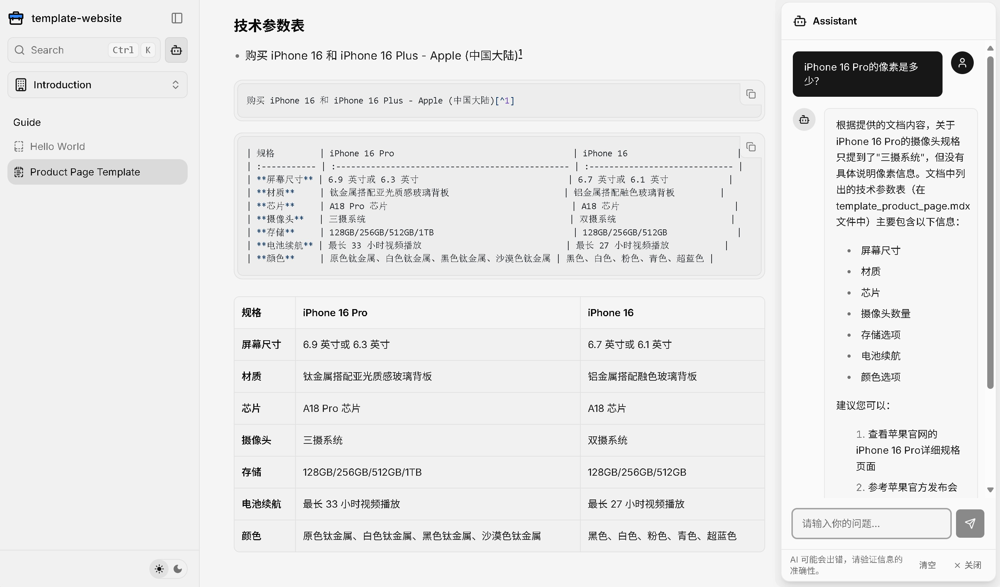

# template-website-docs

This is a Next.js application generated with
[Create Fumadocs](https://github.com/fuma-nama/fumadocs).

Run development server:

```bash
npm run dev
# or
pnpm dev
# or
yarn dev
```

Open http://localhost:3000 with your browser to see the result.

## Explore

In the project, you can see:

- `lib/source.ts`: Code for content source adapter, [`loader()`](https://fumadocs.dev/docs/headless/source-api) provides the interface to access your content.
- `app/layout.config.tsx`: Shared options for layouts, optional but preferred to keep.

| Route                     | Description                                            |
| ------------------------- | ------------------------------------------------------ |
| `app/(home)`              | The route group for your landing page and other pages. |
| `app/docs`                | The documentation layout and pages.                    |
| `app/api/search/route.ts` | The Route Handler for search.                          |

### Fumadocs MDX

A `source.config.ts` config file has been included, you can customise different options like frontmatter schema.

Read the [Introduction](https://fumadocs.dev/docs/mdx) for further details.

## Learn More

To learn more about Next.js and Fumadocs, take a look at the following
resources:

- [Next.js Documentation](https://nextjs.org/docs) - learn about Next.js
  features and API.
- [Learn Next.js](https://nextjs.org/learn) - an interactive Next.js tutorial.
- [Fumadocs](https://fumadocs.vercel.app) - learn about Fumadocs

<a href="https://template-website-docs.vercel.app/docs/documentation/template_product_page">
  
  <h2 align="center">New Features</h2>
</a>

- Data Persistence
  - The model responses to the user's query based on the content of the product page
  - Streamlined process, site owners only need to update document content
- [AI SDK](https://sdk.vercel.ai/docs)
  - Supports DeepSeek, OpenAI, and other model providers
